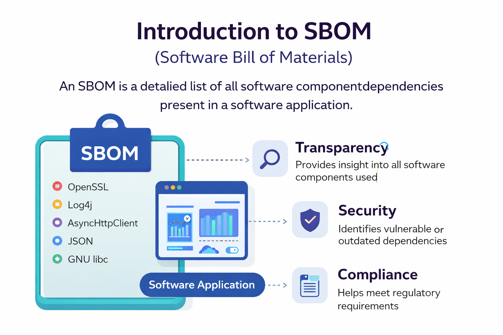
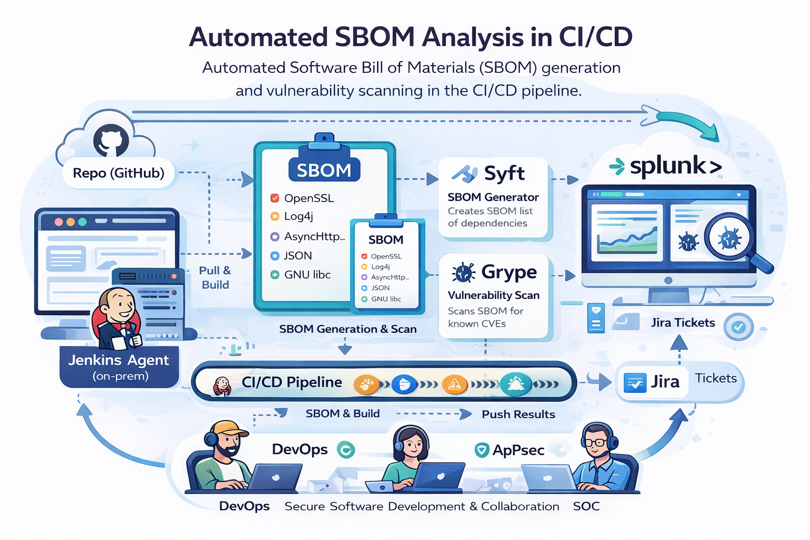
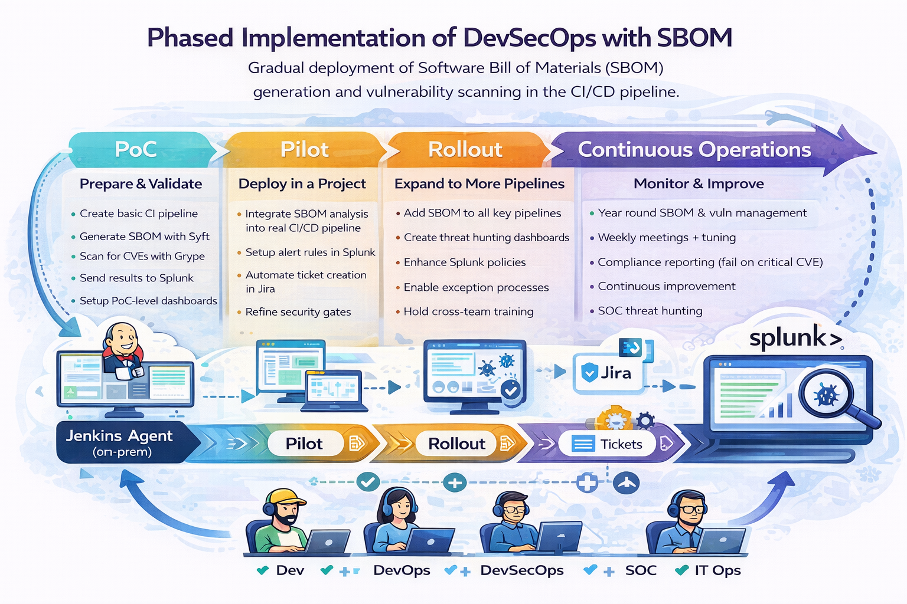
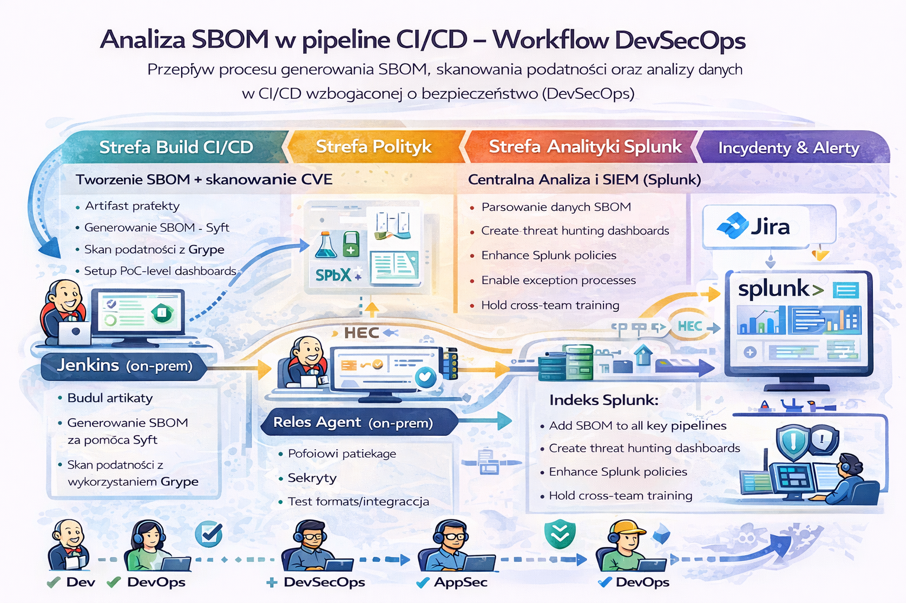
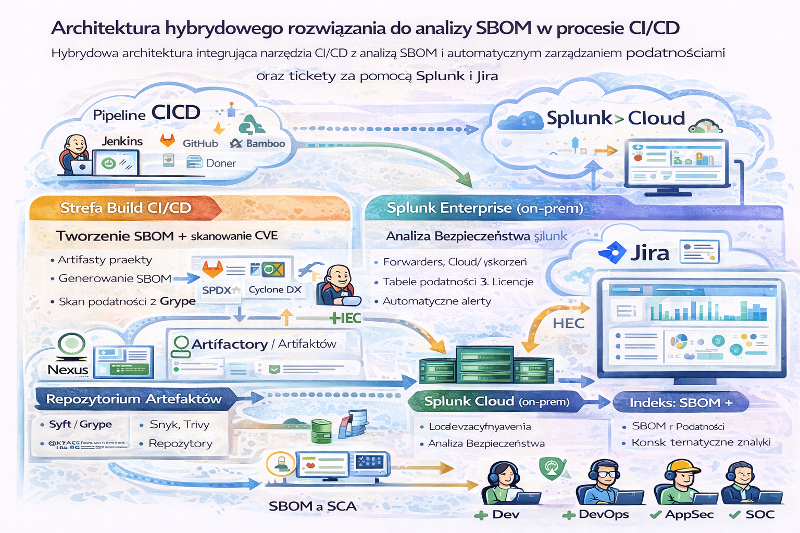

# SBOM LAB — DevSecOps Playground (Elastic/Kibana **lub** Splunk)

To repozytorium to **laboratorium analizy SBOM** zbudowane w duchu: **pomiar → próg → decyzja**, gdzie **SBOM jest odciskiem relacji bytu (Sigillum Relationis)**, a **AID jest jego tożsamością w czasie**.

To nie jest demo „listy bibliotek”. To jest **system wnioskowania o oprogramowaniu**: o jego składzie, zmianie struktury (delta), ryzyku (podatności / licencje) i decyzjach (gate), zasilany przez pipeline CI/CD.

Rdzeń LAB-u jest stały (Jenkins + toolbox), natomiast analityka jest wybierana jako **alternatywny backend**: uruchamiasz albo **Elastic + Kibana**, albo **Splunk**. Nie uruchamiamy ich równolegle — to dwie alternatywy tej samej roli.

## Slideshow (materiał szkoleniowy)

Poniższe slajdy są skrótem „od idei do praktyki”: od definicji SBOM, przez automatyzację w CI/CD, po architekturę i fazy wdrożenia. Umieść je w repo np. w `img/slides/` i zaktualizuj ścieżki, jeśli używasz innego katalogu.

<details>
<summary>Rozwiń slideshow (5 slajdów)</summary>

<p align="center">
  <br>
  <em>1. Introduction to SBOM</em>
</p>

<p align="center">
  <br>
  <em>2. Automated SBOM Analysis in CI/CD</em>
</p>

<p align="center">
  <br>
  <em>3. Phased Implementation of DevSecOps with SBOM</em>
</p>

<p align="center">
  <br>
  <em>4. Workflow DevSecOps: SBOM w CI/CD</em>
</p>

<p align="center">
  <br>
  <em>5. Architektura hybrydowa: CI/CD + SBOM + analityka</em>
</p>

</details>

## Fundament filozoficzny i „dlaczego to działa”

Długi, spójny opis fundamentu („SBOM jako marker strukturalny i ontologiczna pieczęć relacji”, epistemika delty oraz cybernetyczna pętla *pomiar → próg → akcja*, domykana kryptografią dowodu pochodzenia) jest w pliku:

[`kryptologia informacyjna`](`kryptologia-informacyjna-sbom.md`)

To jest „rdzeń interpretacyjny” repo: pokazuje, że SBOM nie jest raportem, tylko sensorem stanu bytu, a dopiero progi i konsekwencje czynią go sterowalnym.

## Co tu znajdziesz (w skrócie)

Masz tu powtarzalne środowisko Docker Compose, spójny kontrakt danych (AID + koperta zdarzenia) oraz pipeline, który wytwarza obserwacje: `sbom`, `scan`, `delta`, `gate`.

W praktyce repo prowadzi Cię przez trzy poziomy: PoC (działa end‑to‑end), pilot (progi i alerty), rollout (wiele pipeline’ów), operacje ciągłe (trend, MTTR, polityki).

## Szybki start (backend jako alternatywa)

Wymagania: Docker + Docker Compose v2, oraz zasoby RAM zależne od backendu (Elastic zwykle potrzebuje więcej).

Wejdź do katalogu środowisk:

```bash
cd środowiska-testowe
```

### Wariant A: Elastic + Kibana (profil `elastic`)

```bash
docker compose -f docker-compose.lab.yml --profile elastic up -d --build
```

Dostęp:
- Elasticsearch: http://localhost:9200
- Kibana: http://localhost:5601
- Jenkins: http://localhost:8080

### Wariant B: Splunk (profil `splunk`)

```bash
docker compose -f docker-compose.lab.yml --profile splunk up -d --build
```

Dostęp:
- Splunk Web: http://localhost:8000
- HEC ingest: http://localhost:8088
- Jenkins: http://localhost:8080

Jeżeli przełączasz backend, zatrzymaj poprzedni wariant (nie uruchamiamy ich równolegle):

```bash
docker compose -f docker-compose.lab.yml stop elasticsearch kibana
# albo:
docker compose -f docker-compose.lab.yml stop splunk
```

## Pierwszy realny pomiar (end‑to‑end)

Pierwszy cel LAB-u jest prosty: wygenerować **jedno zdarzenie** z `AID` i zobaczyć je w analityce. To potwierdza, że pipeline i model danych działają.

Dokładny tutorial (krok po kroku, dla obu backendów) jest tutaj:
- `środowiska-testowe/Środowiska_testowe_LAB_do_analizy_SBOM.md`

## Model danych (minimum)

Każde zdarzenie ma `@timestamp`, `event_type` i `aid.*`. `event_type` przyjmujemy jako słownik: `sbom / scan / delta / gate`. `aid` trzyma tożsamość bytu (K82M jako mandat).

Minimalny przykład:

```json
{
  "@timestamp": "2026-01-25T19:13:49.574Z",
  "event_type": "sbom",
  "aid": { "app_id":"sbom","owner_team":"K82M","env":"lab","vcs_ref":"local","app_version":"0.0.0","repo":"DonkeyJJLove/sbom" },
  "msg": "first measurement ok",
  "payload": {}
}
```

## Jak wnioskować (minimalny zestaw)

W Elastic/Kibana startujesz od KQL:

```kql
aid.owner_team : "K82M" and event_type : "sbom"
```

W Splunk traktujesz event jako JSON i na start robisz `spath`:

```spl
index=* | spath | search aid.owner_team="K82M" event_type="sbom"
```

To jest najkrótsza droga do tego, by „widzieć byt” i zacząć analizować jego strukturę oraz zmianę w czasie.

## Filozofia projektu (krótko, operacyjnie)

SBOM nie jest raportem, tylko **próbką stanu bytu**, powtarzalną i porównywalną. Delta jest ważniejsza niż stan absolutny, bo to zmiana wnosi ryzyko i dryf. Gate to akt decyzyjny, nie alert. Analityka (Elastic lub Splunk) jest pamięcią epistemiczną, nie tylko logami. Jenkins nie „wie” — Jenkins uruchamia obserwację i egzekwuje progi.


